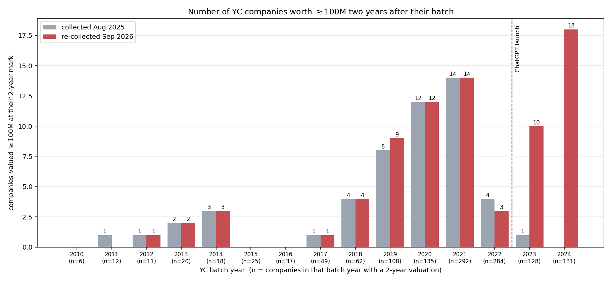
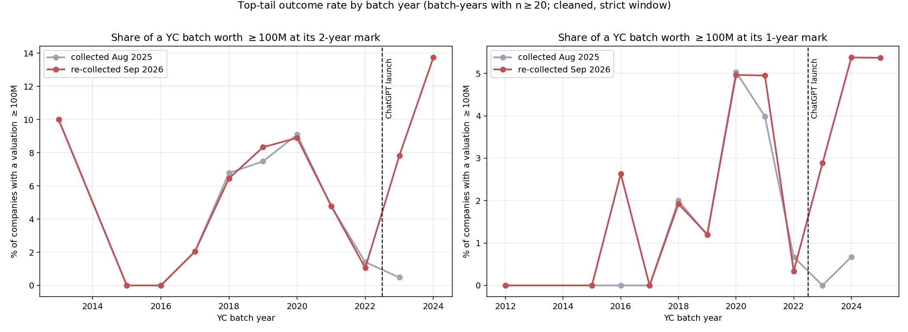
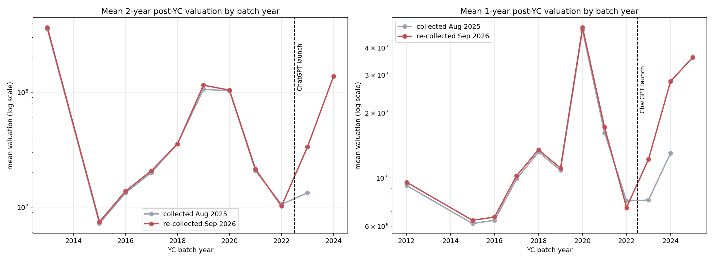

# Re-run, September 2026

A replication of [*Generative AI is not causing YCombinator companies to grow
faster*](https://forum.effectivealtruism.org/posts/C6t6ANhDrAKhQXwdT/generative-ai-is-not-causing-ycombinator-companies-to-grow),
with valuations re-collected 13 months after the original pass.

**The result flips.** In the original data, post-ChatGPT batches were
*under*-represented among the fastest-growing YC companies (0.31× their base
rate) and had a lower mean 2-year valuation than pre-2023 batches (0.29×). With
a year of additional data, they are *over*-represented (1.29×) with a mean 2-year
valuation 1.78× higher, and they reach $1B at twice the pre-2023 rate.

The flip is concentrated entirely in the top tail. The median company in a
post-ChatGPT batch is worth the same as the median company in a pre-ChatGPT
batch — $5.2M vs $5.1M at the 2-year mark, essentially unchanged from the
original run. What changed is that the 2023 and 2024 batches started producing
multi-billion-dollar companies, which they had not done at the time of the
original collection.

---

## Headline comparison

Both columns are produced by identical code (`clean_and_report.py`) over the two
collections. Cleaning and window rules are described under
[Deviations](#deviations-from-the-original-method); the raw, uncleaned pipeline
is in [Effect of cleaning](#effect-of-cleaning).

### 2-year post-YC valuation

| | collected Aug 2025 | re-collected Sep 2026 |
|---|---|---|
| companies with a 2-year figure | 1,278 | 1,335 |
| **2023+ batches in the top 20** | **1/20** | **5/20** |
| 2023+ base rate | 16.3% | 19.4% |
| **lift over base rate** | **0.31×** | **1.29×** |
| mean, pre-2023 | $46.5M | $48.2M |
| mean, 2023+ | $13.3M | $85.8M |
| **mean ratio (2023+ / pre-2023)** | **0.29×** | **1.78×** |
| median, pre-2023 | $5.0M | $5.1M |
| median, 2023+ | $5.0M | $5.2M |
| geometric mean, pre-2023 | $4.8M | $4.9M |
| geometric mean, 2023+ | $4.1M | $7.3M |
| share ≥ $1B, pre-2023 | 0.75% | 0.74% |
| share ≥ $1B, 2023+ | 0.00% | 1.54% |
| Mann-Whitney U, p | 0.648 | 0.136 |
| Welch t on log₁₀ valuation, p | 0.253 | 0.00224 |

### 1-year post-YC valuation

| | collected Aug 2025 | re-collected Sep 2026 |
|---|---|---|
| companies with a 1-year figure | 1,614 | 1,535 |
| **2023+ batches in the top 20** | **2/20** | **7/20** |
| 2023+ base rate | 32.3% | 28.6% |
| **lift over base rate** | **0.31×** | **1.22×** |
| mean, pre-2023 | $17.5M | $18.0M |
| mean, 2023+ | $10.8M | $27.0M |
| **mean ratio** | **0.62×** | **1.50×** |
| median, pre-2023 | $3.7M | $3.8M |
| median, 2023+ | $5.1M | $3.6M |
| geometric mean, 2023+ vs pre-2023 | $3.9M vs $3.3M | $4.6M vs $3.4M |
| share ≥ $1B, 2023+ vs pre-2023 | 0.00% vs 0.18% | 0.46% vs 0.18% |
| Mann-Whitney U, p | 0.0155 | 0.105 |
| Welch t on log₁₀, p | 0.0567 | 0.00125 |

### Companies reaching $100M two years out



The 2023 batches went from **1 company** at $100M+ two years out to **10**, and
the 2024 batches from **0 to 18** — the latter more than any batch year in YC's
history, on a smaller sample than 2021 (131 vs 292 companies with a 2-year
figure). Pre-2023 bars are near-identical between the two collections because
those batches were not re-collected; the single-company differences at 2011,
2019 and 2022 come from the 113 companies the original pass never completed.

Counts fold cohort growth into the outcome — YC batch sizes grew roughly 30×
over this period — so the same data as a *rate* is the fairer comparison, and it
tells the same story:



*Pre-2023 batch-years were not re-collected, so the two lines coincide there by
construction; the 2023-2025 points are where the new information is. The 2024
batches now reach $100M at their 2-year mark more often (13.7%) than any earlier
batch year in the series, including the 2020-2021 ZIRP peak (8.9% / 4.8%).*



## What actually changed: the companies

Every 2023+ company in either top 20 was verified by hand against the web
(2026-09-07), as the original author did. All of these are real and all
post-date the original collection:

| company | batch | mark | valuation | event |
|---|---|---|---|---|
| [Legora](https://techcrunch.com/2026/04/30/legal-ai-startup-legora-hits-5-6-valuation-and-its-battle-with-harvey-just-got-hotter/) | W24 | 2-yr | $5.6B | $600M Series D, Apr 2026 (was $675M at collection time) |
| [Corgi](https://techcrunch.com/2026/07/23/insurance-startup-corgi-reportedly-raised-more-money-at-4b-its-third-round-in-eight-weeks/) | S24 | 2-yr | $4.0B | three rounds in eight weeks, $630M → $4B, Jan-Jul 2026 |
| [AfterQuery](https://techcrunch.com/2026/09/01/afterquery-reportedly-becomes-y-combinators-fastest-ever-unicorn-now-valued-at-3-2b/) | W25 | 1-yr | $3.2B | YC's fastest-ever unicorn, Sep 2026 |
| [Starcloud](https://www.businesswire.com/news/home/20260821884035/en/Starcloud-Raises-$250-Million-at-$2.3-Billion-Valuation-to-Scale-AI-with-Orbital-Data-Centers) | S24 | 2-yr | $2.3B | $250M at $2.3B, Aug 2026 (from $1.1B in Mar 2026) |
| [Emergent](https://techcrunch.com/2026/07/15/indian-ai-coding-startup-emergent-becomes-a-unicorn-just-over-a-year-after-launch/) | S24 | 2-yr | $1.5B | $130M Series C, Jul 2026 |
| [Tennr](https://fortune.com/2025/06/18/tennr-health-tech-ai-patient-referral-ivp-a16z-lightspeed-iconiq-series-c/) | W23 | 2-yr | $626M | the single 2023+ company in the *original* top 20 |
| [Reducto](https://reducto.ai/blog/reducto-series-b-funding) | W24 | 1-yr | $621M | Series B at ~$600M, Oct 2025 |
| [David AI](https://news.bloomberglaw.com/private-equity/david-ai-notches-500-million-value-bringing-audio-to-ai-models) | S24 | 1-yr | $518M | $50M at $500M, Oct 2025 |
| [Delve](https://delve.co/blog/series-a) | W24 | 1-yr | $311M | $32M at $300M, Jul 2025 — note: [expelled from YC in Apr 2026 amid fraud allegations](https://captaincompliance.com/news/the-delve-scandal-fake-soc-2-audits-open-source-code-theft-and-exit-from-y-combinator/); the valuation event is real, the company may not be |
| [Wafer](https://cryptobriefing.com/wafer-raises-40m-200m-valuation/) | S25 | 1-yr | $200M | $40M at $200M, Sep 2026 |

## Robustness: the flip is tail-driven but not one-company-driven

The 2023+ mean advantage at the 2-year mark does not survive deleting the top 10
companies, but the *rate* of top-tail outcomes does:

| statistic (2-year mark) | pre-2023 | 2023+ |
|---|---|---|
| mean | $48.2M | $85.8M |
| mean excluding top 3 | $32.3M | $40.3M |
| mean excluding top 10 | $22.4M | $22.4M |
| 10% trimmed mean (proportional) | $11.3M | $20.6M |
| share ≥ $100M | 4.74% | 10.81% |
| share ≥ $1B | 0.74% | 1.54% |

Top 5 companies account for 63% of the 2023+ group's total value. So "the mean
is 1.78× higher" is a statement about five companies. "Twice as likely to be
worth $1B, 2.3× as likely to be worth $100M, and 1.8× on a proportionally
trimmed mean" is a statement about the cohort.

Median and geometric-mean movements remain small in both directions, so the
original post's core observation — *the typical YC company is not growing
faster* — survives the re-run intact. What does not survive is the stronger
reading, that the top of the distribution shows no GenAI effect either.

## Deviations from the original method

Four, of which the first is forced:

1. **Model.** `claude-3-5-haiku-latest` has been retired. The re-collection uses
   `claude-haiku-4-5`, the same tier. Everything else about the collector —
   prompt, `submit_valuations` tool schema, `max_uses: 10` web search — is
   unchanged (`yc_valuation_analyzer_2026.py`).
2. **Alias dedup.** The YC directory lists some companies twice under variant
   names, so one company can occupy two top-20 slots. In the raw re-run,
   "Legora" and "Legora (formerly Leya)" both appeared in the 2-year top 5. Names
   are normalised and collapsed to the higher figure, because the parser's
   dominant error is *understatement*: `parse_valuation` takes the first number
   in a string, so Corgi's `"$630M (January), $1.3B (May), $4.0B (July)"` parsed
   as $630M.
3. **Synthetic-estimate filter.** StartupHub.ai and similar now publish
   algorithmic "effective valuations" derived from sector comparables, with
   stated confidence as low as 19%. Two of those ([Shor](https://www.startuphub.ai/startups/shor-yc-s25)
   at "$2.0B", [Golpo](https://www.startuphub.ai/startups/golpo-yc-s25) at
   "$1.7B" — actual seed round $4.1M) landed in the raw 1-year top 10. Rows whose
   own notes say the figure is modelled from comparables are dropped (138 rows).
   Filtering by *domain* instead would be wrong and was: it discarded a real
   Legora round reported in a startuphub news article.
4. **1-year window.** The original's `get_two_year_valuation` accepts only the
   target year, but `get_one_year_valuation` accepts target ±1. That asymmetry is
   far more consequential for recent batches, whose only datapoint is usually the
   most recent year: Corgi's **2026** $4B round was being counted as its 2025
   "1-year" valuation. The tables above use the strict window for both. Under the
   original ±1 window the 1-year flip is larger (8/20, mean ratio 1.38×), so this
   choice is conservative.

## Errors found in the new collection

Manual verification of the top 20 — the same step the original author took —
caught five fabrications and misattributions, all of which inflated the 2023+
group. They are listed with reasons in `FABRICATED` in `clean_and_report.py`:

- **Rimward** (S23), **AtlasGrid** (F25), **Piggy Robotics** (F25) were each
  given the *identical* invented round: "$330M Series B at $6.6B, December 2025".
  No such round exists for any of them. Two of the three occupied the #1 and #2
  slots of the raw 1-year top 20.
- **Clado** (X25) was given Delve's real round verbatim ($32M Series A at $300M
  led by Insight Partners), sourced to a `clado.ai` URL that does not exist.
  Clado has raised $2.5M total.
- **Continue** (S23) was credited with a $65M Series A at $500M. The YC S23
  continue.dev raised ~$5M and was
  [acqui-hired by Cursor](https://thenewstack.io/cursor-acquires-continue-coding/)
  in June 2026 for undisclosed terms.
- **Cortex AI** (F25, robotics data, $6.5M raised) was given
  [Cortex Applications'](https://news.bloomberglaw.com/private-equity/sequoia-backs-developer-startup-cortex-at-470-million-valuation)
  $470M — a different company, YC W20.
- **Unify** (W23) had a July-2025 round recorded under 2024; the row's own notes
  admit it ("reflects valuation at end of 2024 period").

Duplicate/similar company names remain the dominant failure mode, exactly as the
original post warned.

## Collection-vintage check

In the re-run, pre-2023 batches keep their Aug-2025 numbers while 2023+ batches
were re-collected with a different model. If the new model simply reports bigger
numbers, that alone would produce the flip. It does not.

2023 and 2024 batch companies were collected in *both* passes, and some of their
marks (target year ≤ 2024) were already fully historical in Aug 2025. Comparing
the same (company, mark) pairs across the two vintages:

| mark's target year | n | identical within 2% | mean ratio | median paired ratio | geo-mean ratio | revised up / down |
|---|---|---|---|---|---|---|
| 2024 (fully historical by Aug 2025) | 63 | 24% | 1.36× | 1.00× | 1.42× | 40% / 37% |
| 2025 (partly in the future then) | 95 | 8% | 1.82× | 0.87× | 0.75× | 38% / 54% |
| 2025, 2-year mark | 58 | 12% | 1.75× | 1.03× | 1.70× | 50% / 38% |

Disagreement is large but roughly symmetric, and the medians are unchanged — no
systematic inflation. The mean drift sits where genuinely new information
arrived (2025 was only half over when the original pass ran). Two caveats fall
out of this table, though: only ~24% of values agree even for a year both passes
could fully observe, so per-company figures are very noisy in both collections;
and the new pass produced *fewer* numeric marks (290 vs 521 for 2023-2024 batch
1-year marks), because `claude-haiku-4-5` declines to submit anything when it
finds nothing — 30% of companies returned no data vs 18% in the original pass.

## Effect of cleaning

For transparency, the raw pipeline (no dedup, no estimate filter, no
fabrication removal, original ±1 window) gives a *larger* flip than the cleaned
numbers reported above:

| | raw | cleaned |
|---|---|---|
| 2-yr: 2023+ in top 20 | 6/20 (1.47×) | 5/20 (1.29×) |
| 2-yr: mean ratio | 2.65× | 1.78× |
| 1-yr: 2023+ in top 20 | 10/20 (1.45×) | 7/20 (1.22×) |
| 1-yr: mean ratio | 2.64× | 1.50× |

Reproduce with `python clean_and_report.py --raw`.

## What this does and does not establish

Unchanged from the original post: this is a before/after comparison with no
counterfactual, so "GenAI caused it" is not identified. Specific to this re-run:

- **Exposure time is not equal.** A pre-2023 company's 2-year mark is drawn from
  a 20-year window of market conditions; the 2023+ marks are all drawn from
  2025-2026, a period of extraordinary AI funding. The comparison partly measures
  *when* a batch was 2 years old, not what the batch was building. The 2019-2020
  batches show the same kind of spike for the same kind of reason (ZIRP).
- **Valuation is not growth**, and a private mark set in a hot funding market is
  a weak proxy for either. The Delve entry — a real $300M round at a company
  later expelled from YC over fraud allegations — is a good illustration.
- **The "raise amount as valuation" flaw persists.** Rows like
  `"$4.8M seed funding"` are parsed as a $4.8M valuation. This is in the original
  method and was left in place for comparability; it mostly affects the small end,
  where the medians live.
- **Sparse and noisy data.** 30% of companies returned nothing; of those that
  did, most rows are not parseable as a number. The 1-year 2023+ sample is 439
  companies out of the 1,890 companies in those batches.

## Files

| file | what |
|---|---|
| `yc-scrape/fetch_yc_companies_2026.py` | directory scrape; pulls a live Algolia key (the key hardcoded in the original now 403s). 6,203 companies across 50 batches, up from 5,311 |
| `yc_valuation_analyzer_2026.py` | collector: `claude-haiku-4-5`, current year 2026, concurrency + 429 backoff, per-call usage logged to an `api_usage` table |
| `analysis_2026.py` | the original notebook as a parameterised script (db, inflation target, cutoff) + significance tests |
| `plots_2026.py` | the three figures in this document |
| `clean_and_report.py` | cleaning layer and the side-by-side comparison; `--raw` disables cleaning |
| `vintage_check.py` | paired old-vs-new comparison helper |
| `yc_valuations_2026.db` | re-collection. Original `yc_valuations.db` is untouched |
| `baseline_2025.md`, `rerun_2026.md`, `cleaned_report.txt` | generated reports |

Re-collection covered 2,616 companies (all 2023+ batches plus the 113 pre-2023
companies the original pass never completed): $458.51 of API spend, 29.5 minutes
at concurrency 25, $0.175/company. CPI data refreshed via `cpi.update()`;
all figures inflated to June 2026 dollars.

## Reproducing

```bash
python yc-scrape/fetch_yc_companies_2026.py           # refresh the directory
ANTHROPIC_API_KEY=... python yc_valuation_analyzer_2026.py --concurrency 25
python clean_and_report.py                            # cleaned comparison
python clean_and_report.py --raw                      # uncleaned
python analysis_2026.py --db yc_valuations_2026.db --to-year 2026 \
       --cutoff 2026 --label "Re-run" --out rerun_2026
```
