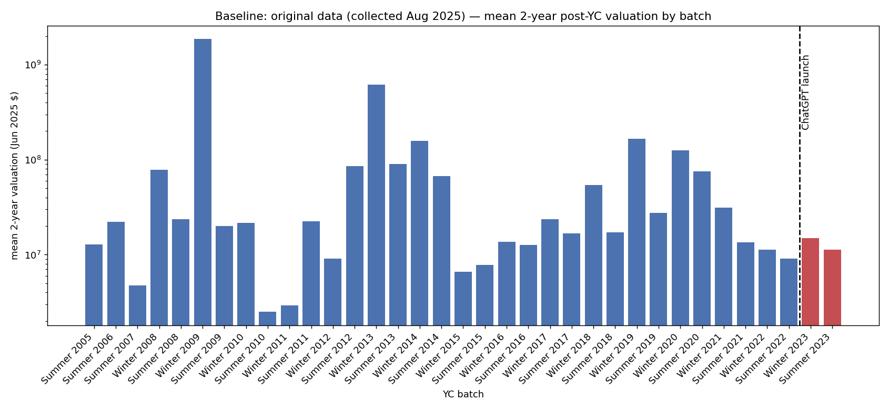
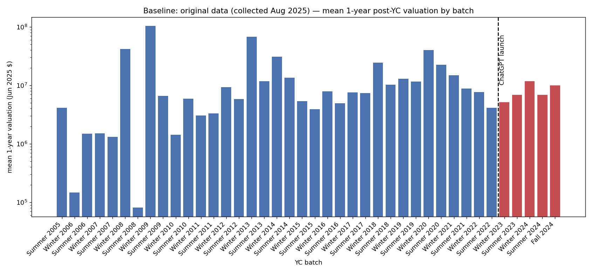

# Baseline: original data (collected Aug 2025)

- database: `yc_valuations.db`  ·  inflated to June 2025 dollars  ·  batches with yc_year < 2025
- companies with completed collection: **3949**
- valuation rows: **19704**, of which numerically parseable: **9347**

## 2-year post-YC valuation

companies with a 2-year figure: **1295** (batch years 2005–2023)

### Top 20

| # | company | batch | valuation (Jun 2025 $) | source |
|---|---|---|---|---|
| 1 | Deel | Winter 2019 | $6.5B | https://www.deel.com/blog/weve-raised-our-series-d/ |
| 2 | Zenefits | Winter 2013 | $6.1B | https://techcrunch.com/2015/05/06/zenefits-rising-hrs-hottes |
| 3 | Whatnot | Winter 2020 | $4.0B | https://techcrunch.com |
| 4 | Jeeves | Summer 2020 | $2.3B | https://techcrunch.com/2022/03/22/fintech-startup-jeeves-rai |
| 5 | Airbnb | Winter 2009 | $1.9B | https://techcrunch.com/2011/07/24/airbnb-bags-112-million-in |
| 6 | Prometheus | Winter 2019 | $1.8B | https://tracxn.com/d/companies/prometheus |
| 7 | Airbyte | Winter 2020 | $1.6B | https://tracxn.com/d/companies/airbyte/ |
| 8 | Yassir | Winter 2020 | $1.1B | https://tracxn.com/d/companies/yassir/funding-and-investors |
| 9 | AtoB | Summer 2020 | $870.9M | https://tracxn.com/d/companies/atob |
| 10 | QuickNode | Winter 2021 | $845.8M | https://techcrunch.com/2023/01/24/quicknode-raises-60m-at-80 |
| 11 | DoorDash | Summer 2013 | $804.2M | https://www.newcomer.co/p/the-story-of-a-cap-table-doordash |
| 12 | Cruise | Winter 2014 | $669.2M | https://en.wikipedia.org/wiki/Cruise_(autonomous_vehicle) |
| 13 | Vouch | Summer 2019 | $653.0M | https://techcrunch.com/2021/09/10/vouch-business-insurance-p |
| 14 | Newfront | Winter 2018 | $625.6M | https://tracxn.com/d/companies/newfront |
| 15 | Tennr ⭐ | Winter 2023 | $605.0M | https://www.ycombinator.com/companies/tennr |
| 16 | Ginkgo Bioworks | Summer 2014 | $602.2M | https://pitchbook.com/news/articles/scoop-biotech-unicorn-gi |
| 17 | Flexport | Winter 2014 | $488.5M | https://en.wikipedia.org/wiki/Flexport |
| 18 | Instacart | Summer 2012 | $479.1M | https://equable.org/instacart-and-valuation-risk/ |
| 19 | Postscript | Winter 2019 | $474.9M | https://research.contrary.com/company/postscript |
| 20 | Observe.AI | Winter 2018 | $380.4M | https://techcrunch.com/2022/04/12/observe-ai-raises-125m-add |

**2023+ batches in the top 20: 1/20 (5%)** vs a base rate of 211/1295 (16.3%) → 0.31× the base rate

### Pre-2023 vs 2023+

| | n | mean | median | geo-mean | ≥$100M | ≥$1B |
|---|---|---|---|---|---|---|
| pre-2023 | 1084 | $46.1M | $5.1M | $4.9M | 4.8% | 0.7% |
| 2023+ | 211 | $13.3M | $5.0M | $4.2M | 0.5% | 0.0% |

- mean ratio (2023+ / pre-2023): **0.29×**, median ratio: **0.98×**
- Mann-Whitney U two-sided p = **0.693**; Welch t on log10 valuation p = **0.276**

### By batch

| batch | n | mean | median |
|---|---|---|---|
| Summer 2005 | 1 | $12.8M | $12.8M |
| Summer 2006 | 2 | $22.1M | $22.1M |
| Summer 2007 | 4 | $4.7M | $1.9M |
| Winter 2008 | 4 | $78.5M | $89K |
| Summer 2008 | 1 | $23.7M | $23.7M |
| Winter 2009 | 1 | $1.9B | $1.9B |
| Summer 2009 | 3 | $20.0M | $22.9M |
| Winter 2010 | 2 | $21.6M | $21.6M |
| Summer 2010 | 4 | $2.5M | $1.5M |
| Winter 2011 | 7 | $2.9M | $1.4M |
| Summer 2011 | 6 | $22.4M | $4.6M |
| Winter 2012 | 5 | $9.1M | $2.7M |
| Summer 2012 | 6 | $85.9M | $5.6M |
| Winter 2013 | 10 | $614.2M | $3.7M |
| Summer 2013 | 10 | $90.2M | $7.8M |
| Winter 2014 | 8 | $157.3M | $7.7M |
| Summer 2014 | 10 | $67.3M | $3.3M |
| Winter 2015 | 14 | $6.6M | $3.8M |
| Summer 2015 | 12 | $7.8M | $3.9M |
| Winter 2016 | 21 | $13.6M | $6.4M |
| Summer 2016 | 16 | $12.7M | $6.2M |
| Winter 2017 | 22 | $23.8M | $6.1M |
| Summer 2017 | 27 | $16.9M | $12.6M |
| Winter 2018 | 29 | $54.3M | $3.7M |
| Summer 2018 | 30 | $17.2M | $2.6M |
| Winter 2019 | 60 | $166.5M | $5.9M |
| Summer 2019 | 48 | $27.6M | $8.2M |
| Winter 2020 | 68 | $125.8M | $12.0M |
| Summer 2020 | 67 | $75.5M | $13.9M |
| Winter 2021 | 120 | $31.4M | $6.9M |
| Summer 2021 | 175 | $13.5M | $4.4M |
| Winter 2022 | 186 | $11.3M | $3.8M |
| Summer 2022 | 105 | $9.1M | $3.6M |
| Winter 2023 | 115 | $15.0M | $4.2M |
| Summer 2023 | 96 | $11.3M | $7.0M |

## 1-year post-YC valuation

companies with a 1-year figure: **2908** (batch years 2005–2024)

### Top 20

| # | company | batch | valuation (Jun 2025 $) | source |
|---|---|---|---|---|
| 1 | Airbyte | Winter 2020 | $1.8B | https://businesswire.com/news/home/20211217005648/en/ |
| 2 | Whatnot | Winter 2020 | $1.8B | https://techcrunch.com |
| 3 | AtoB | Summer 2020 | $870.9M | https://tracxn.com/d/companies/atob |
| 4 | Teespring | Winter 2013 | $832.3M | https://news.crunchbase.com/startups/heres-math-behind-teesp |
| 5 | Zenefits | Winter 2013 | $676.7M | https://techcrunch.com/2015/05/06/zenefits-rising-hrs-hottes |
| 6 | Legora (formerly Leya) ⭐ | Winter 2024 | $675.0M | https://www.startuphub.ai/legora-secures-80-million-series-b |
| 7 | Cruise | Winter 2014 | $669.2M | https://en.wikipedia.org/wiki/Cruise_(autonomous_vehicle) |
| 8 | Newfront | Winter 2018 | $625.6M | https://tracxn.com/d/companies/newfront |
| 9 | Jeeves | Summer 2020 | $593.6M | https://techcrunch.com/2021/09/02/fintech-startup-jeeves-rai |
| 10 | PostHog | Winter 2020 | $534.2M | https://nasdaq.com/articles/posthog-funding |
| 11 | Postscript | Winter 2019 | $474.9M | https://research.contrary.com/company/postscript |
| 12 | Observe.AI | Winter 2018 | $380.4M | https://techcrunch.com/2022/04/12/observe-ai-raises-125m-add |
| 13 | Khatabook | Summer 2018 | $346.3M | https://inc42.com/company/khatabook/funding/ |
| 14 | Heroku | Winter 2008 | $313.7M | https://techcrunch.com/2010/12/08/breaking-salesforce-buys-h |
| 15 | SFA Therapeutics | Summer 2021 | $272.1M | https://www.sfatherapeutics.com/news/this-pharma-startup-bac |
| 16 | QuickNode | Winter 2021 | $272.1M | https://tracxn.com/d/companies/quicknode/ |
| 17 | Ginkgo Bioworks | Summer 2014 | $270.3M | https://pitchbook.com/news/articles/scoop-biotech-unicorn-gi |
| 18 | Vouch | Summer 2019 | $264.5M | https://techcrunch.com/2019/11/20/vouch-raises-45m-led-by-yc |
| 19 | Tractian | Winter 2021 | $223.2M | https://www.cbinsights.com/company/tractian/financials |
| 20 | Moonshot Brands | Winter 2021 | $195.9M | https://techcrunch.com/2022/03/15/moonshot-brands-funding-ac |

**2023+ batches in the top 20: 1/20 (5%)** vs a base rate of 814/2908 (28.0%) → 0.18× the base rate

### Pre-2023 vs 2023+

| | n | mean | median | geo-mean | ≥$100M | ≥$1B |
|---|---|---|---|---|---|---|
| pre-2023 | 2094 | $13.1M | $2.5M | $1.9M | 1.9% | 0.1% |
| 2023+ | 814 | $7.9M | $2.6M | $2.4M | 0.2% | 0.0% |

- mean ratio (2023+ / pre-2023): **0.60×**, median ratio: **1.04×**
- Mann-Whitney U two-sided p = **0.00212**; Welch t on log10 valuation p = **0.000609**

### By batch

| batch | n | mean | median |
|---|---|---|---|
| Summer 2005 | 7 | $4.2M | $410K |
| Winter 2006 | 5 | $146K | $32K |
| Summer 2006 | 9 | $1.5M | $199K |
| Winter 2007 | 7 | $1.5M | $442K |
| Summer 2007 | 15 | $1.3M | $310K |
| Winter 2008 | 8 | $42.2M | $182K |
| Summer 2008 | 3 | $81K | $29K |
| Winter 2009 | 1 | $103.6M | $103.6M |
| Summer 2009 | 9 | $6.6M | $1.8M |
| Winter 2010 | 10 | $1.4M | $888K |
| Summer 2010 | 17 | $5.9M | $1.6M |
| Winter 2011 | 21 | $3.0M | $1.7M |
| Summer 2011 | 23 | $3.3M | $2.0M |
| Winter 2012 | 25 | $9.4M | $2.0M |
| Summer 2012 | 27 | $5.8M | $2.1M |
| Winter 2013 | 23 | $68.0M | $1.4M |
| Summer 2013 | 24 | $11.9M | $2.6M |
| Winter 2014 | 31 | $31.2M | $677K |
| Summer 2014 | 28 | $13.5M | $489K |
| Winter 2015 | 39 | $5.4M | $2.3M |
| Summer 2015 | 36 | $3.9M | $673K |
| Winter 2016 | 48 | $7.9M | $1.5M |
| Summer 2016 | 48 | $4.9M | $1.7M |
| Winter 2017 | 61 | $7.6M | $2.6M |
| Summer 2017 | 59 | $7.4M | $2.6M |
| Winter 2018 | 67 | $24.4M | $2.5M |
| Summer 2018 | 55 | $10.3M | $2.5M |
| Winter 2019 | 107 | $12.9M | $2.3M |
| Summer 2019 | 82 | $11.7M | $2.0M |
| Winter 2020 | 135 | $40.5M | $2.7M |
| Summer 2020 | 117 | $22.5M | $3.5M |
| Winter 2021 | 212 | $15.0M | $3.6M |
| Summer 2021 | 289 | $8.8M | $3.1M |
| Winter 2022 | 280 | $7.7M | $3.1M |
| Summer 2022 | 166 | $4.2M | $1.6M |
| Winter 2023 | 197 | $5.2M | $1.8M |
| Summer 2023 | 168 | $6.9M | $3.3M |
| Winter 2024 | 197 | $11.9M | $3.1M |
| Summer 2024 | 185 | $6.9M | $2.0M |
| Fall 2024 | 67 | $10.0M | $5.0M |

