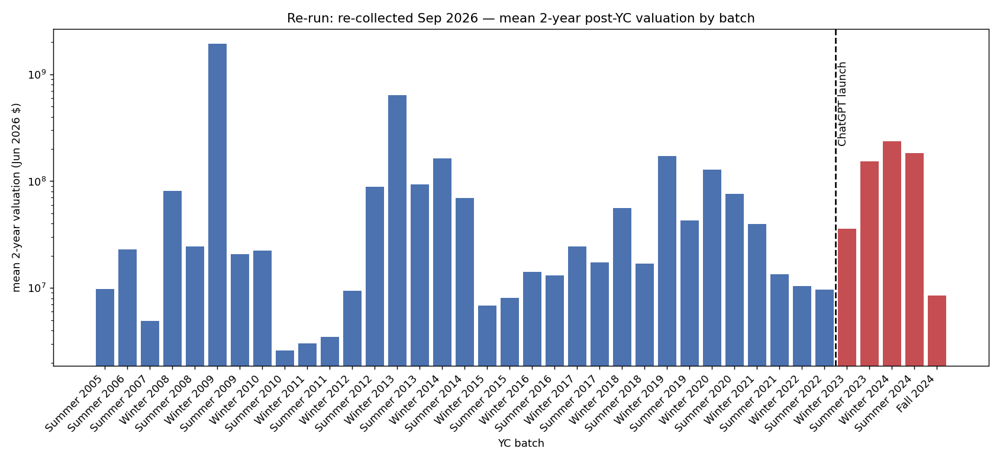
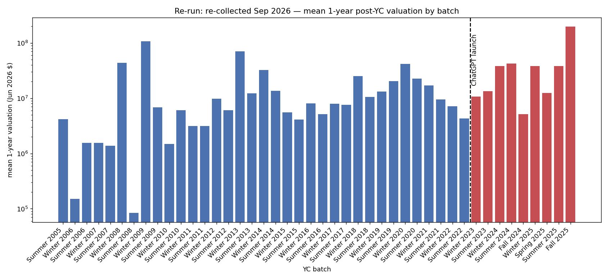

# Re-run: re-collected Sep 2026

- database: `yc_valuations_2026.db`  ·  inflated to June 2026 dollars  ·  batches with yc_year < 2026
- companies with completed collection: **4404**
- valuation rows: **21360**, of which numerically parseable: **9782**

## 2-year post-YC valuation

companies with a 2-year figure: **1371** (batch years 2005–2024)

### Top 20

| # | company | batch | valuation (Jun 2026 $) | source |
|---|---|---|---|---|
| 1 | Rimward ⭐ | Summer 2023 | $6.8B | https://www.crunchbase.com/organization/rimward |
| 2 | Deel | Winter 2019 | $6.8B | https://www.deel.com/blog/weve-raised-our-series-d/ |
| 3 | Zenefits | Winter 2013 | $6.3B | https://techcrunch.com/2015/05/06/zenefits-rising-hrs-hottes |
| 4 | Legora (formerly Leya) ⭐ | Winter 2024 | $5.6B | https://www.globallegalpost.com/news/legora-extends-series-d |
| 5 | Legora ⭐ | Winter 2024 | $5.6B | https://legora.com/newsroom/legora-raises-550-million-series |
| 6 | Whatnot | Winter 2020 | $4.2B | https://techcrunch.com |
| 7 | Corgi Insurance ⭐ | Summer 2024 | $4.0B | https://en.wikipedia.org/wiki/Corgi_(insurance_company) |
| 8 | Jeeves | Summer 2020 | $2.4B | https://techcrunch.com/2022/03/22/fintech-startup-jeeves-rai |
| 9 | Starcloud ⭐ | Summer 2024 | $2.3B | https://www.businesswire.com/news/home/20260821884035/en/Sta |
| 10 | Airbnb | Winter 2009 | $1.9B | https://techcrunch.com/2011/07/24/airbnb-bags-112-million-in |
| 11 | Prometheus | Winter 2019 | $1.8B | https://tracxn.com/d/companies/prometheus |
| 12 | Airbyte | Winter 2020 | $1.7B | https://tracxn.com/d/companies/airbyte/ |
| 13 | Emergent ⭐ | Summer 2024 | $1.5B | https://emergent.sh/news/emergent-now-a-unicorn-at-1-5-billi |
| 14 | Yassir | Winter 2020 | $1.1B | https://tracxn.com/d/companies/yassir/funding-and-investors |
| 15 | AtoB | Summer 2020 | $901.6M | https://tracxn.com/d/companies/atob |
| 16 | QuickNode | Winter 2021 | $875.6M | https://techcrunch.com/2023/01/24/quicknode-raises-60m-at-80 |
| 17 | Quicknode | Winter 2021 | $875.6M | https://www.coindesk.com/business/2023/01/24/quicknode-raise |
| 18 | DoorDash | Summer 2013 | $832.6M | https://www.newcomer.co/p/the-story-of-a-cap-table-doordash |
| 19 | Vendr | Summer 2019 | $737.5M | https://www.vendr.com/blog/vendr-series-a-future-saas-buying |
| 20 | Cruise | Winter 2014 | $692.8M | https://en.wikipedia.org/wiki/Cruise_(autonomous_vehicle) |

**2023+ batches in the top 20: 6/20 (30%)** vs a base rate of 280/1371 (20.4%) → 1.47× the base rate

### Pre-2023 vs 2023+

| | n | mean | median | geo-mean | ≥$100M | ≥$1B |
|---|---|---|---|---|---|---|
| pre-2023 | 1091 | $48.5M | $5.3M | $5.0M | 4.8% | 0.7% |
| 2023+ | 280 | $128.4M | $5.2M | $7.5M | 11.4% | 2.1% |

- mean ratio (2023+ / pre-2023): **2.65×**, median ratio: **0.99×**
- Mann-Whitney U two-sided p = **0.155**; Welch t on log10 valuation p = **0.00137**

### By batch

| batch | n | mean | median |
|---|---|---|---|
| Summer 2005 | 2 | $9.8M | $9.8M |
| Summer 2006 | 2 | $22.9M | $22.9M |
| Summer 2007 | 4 | $4.9M | $1.9M |
| Winter 2008 | 4 | $81.2M | $92K |
| Summer 2008 | 1 | $24.5M | $24.5M |
| Winter 2009 | 1 | $1.9B | $1.9B |
| Summer 2009 | 3 | $20.7M | $23.7M |
| Winter 2010 | 2 | $22.4M | $22.4M |
| Summer 2010 | 4 | $2.6M | $1.5M |
| Winter 2011 | 7 | $3.0M | $1.4M |
| Summer 2011 | 5 | $3.5M | $3.7M |
| Winter 2012 | 5 | $9.4M | $2.8M |
| Summer 2012 | 6 | $88.9M | $5.8M |
| Winter 2013 | 10 | $635.9M | $3.8M |
| Summer 2013 | 10 | $93.4M | $8.0M |
| Winter 2014 | 8 | $162.9M | $8.0M |
| Summer 2014 | 10 | $69.7M | $3.4M |
| Winter 2015 | 14 | $6.9M | $4.0M |
| Summer 2015 | 12 | $8.0M | $4.0M |
| Winter 2016 | 21 | $14.1M | $6.6M |
| Summer 2016 | 16 | $13.2M | $6.4M |
| Winter 2017 | 22 | $24.6M | $6.3M |
| Summer 2017 | 27 | $17.4M | $13.0M |
| Winter 2018 | 29 | $56.3M | $3.8M |
| Summer 2018 | 33 | $17.0M | $3.2M |
| Winter 2019 | 60 | $171.4M | $5.7M |
| Summer 2019 | 49 | $42.9M | $8.6M |
| Winter 2020 | 69 | $128.6M | $13.5M |
| Summer 2020 | 69 | $76.1M | $14.1M |
| Winter 2021 | 121 | $39.8M | $7.7M |
| Summer 2021 | 174 | $13.5M | $4.5M |
| Winter 2022 | 185 | $10.5M | $3.8M |
| Summer 2022 | 106 | $9.6M | $3.7M |
| Winter 2023 | 82 | $35.8M | $6.2M |
| Summer 2023 | 57 | $153.3M | $4.1M |
| Winter 2024 | 60 | $235.1M | $7.1M |
| Summer 2024 | 54 | $184.2M | $3.5M |
| Fall 2024 | 27 | $8.5M | $3.3M |

## 1-year post-YC valuation

companies with a 1-year figure: **3232** (batch years 2005–2025)

### Top 20

| # | company | batch | valuation (Jun 2026 $) | source |
|---|---|---|---|---|
| 1 | AtlasGrid ⭐ | Fall 2025 | $6.6B | https://pitchbook.com/profiles/company/1162601-29 |
| 2 | Piggy Robotics ⭐ | Fall 2025 | $6.6B | https://www.crunchbase.com/organization/piggy-robotics |
| 3 | Corgi Insurance ⭐ | Summer 2024 | $4.0B | https://en.wikipedia.org/wiki/Corgi_(insurance_company) |
| 4 | AfterQuery ⭐ | Winter 2025 | $3.2B | https://techcrunch.com/2026/09/01/afterquery-reportedly-beco |
| 5 | Shor ⭐ | Summer 2025 | $2.0B | https://www.startuphub.ai/startups/shor-yc-s25 |
| 6 | Legora ⭐ | Winter 2024 | $1.9B | https://legora.com/blog/series-c |
| 7 | Legora (formerly Leya) ⭐ | Winter 2024 | $1.9B | https://legora.com/blog/series-c |
| 8 | Airbyte | Winter 2020 | $1.8B | https://businesswire.com/news/home/20211217005648/en/ |
| 9 | Whatnot | Winter 2020 | $1.8B | https://techcrunch.com |
| 10 | Golpo ⭐ | Summer 2025 | $1.7B | https://www.startuphub.ai/startups/golpo-yc-s25 |
| 11 | AtoB | Summer 2020 | $901.6M | https://tracxn.com/d/companies/atob |
| 12 | Teespring | Winter 2013 | $861.7M | https://news.crunchbase.com/startups/heres-math-behind-teesp |
| 13 | Vendr | Summer 2019 | $737.5M | https://www.vendr.com/blog/vendr-series-a-future-saas-buying |
| 14 | Zenefits | Winter 2013 | $700.6M | https://techcrunch.com/2015/05/06/zenefits-rising-hrs-hottes |
| 15 | Cruise | Winter 2014 | $692.8M | https://en.wikipedia.org/wiki/Cruise_(autonomous_vehicle) |
| 16 | Newfront | Winter 2018 | $647.7M | https://tracxn.com/d/companies/newfront |
| 17 | Corgi ⭐ | Summer 2024 | $630.0M | https://techcrunch.com/2026/05/06/insurance-startup-corgi-hi |
| 18 | Reducto ⭐ | Winter 2024 | $621.2M | https://research.contrary.com/company/reducto |
| 19 | Jeeves | Summer 2020 | $614.6M | https://techcrunch.com/2021/09/02/fintech-startup-jeeves-rai |
| 20 | PostHog | Winter 2020 | $553.1M | https://nasdaq.com/articles/posthog-funding |

**2023+ batches in the top 20: 10/20 (50%)** vs a base rate of 1115/3232 (34.5%) → 1.45× the base rate

### Pre-2023 vs 2023+

| | n | mean | median | geo-mean | ≥$100M | ≥$1B |
|---|---|---|---|---|---|---|
| pre-2023 | 2117 | $14.0M | $2.6M | $2.0M | 2.1% | 0.1% |
| 2023+ | 1115 | $36.8M | $2.1M | $2.6M | 3.6% | 0.7% |

- mean ratio (2023+ / pre-2023): **2.64×**, median ratio: **0.80×**
- Mann-Whitney U two-sided p = **0.0189**; Welch t on log10 valuation p = **7.15e-05**

### By batch

| batch | n | mean | median |
|---|---|---|---|
| Summer 2005 | 8 | $4.2M | $1.9M |
| Winter 2006 | 5 | $151K | $33K |
| Summer 2006 | 9 | $1.5M | $206K |
| Winter 2007 | 7 | $1.6M | $458K |
| Summer 2007 | 15 | $1.4M | $321K |
| Winter 2008 | 8 | $43.7M | $188K |
| Summer 2008 | 3 | $84K | $31K |
| Winter 2009 | 1 | $107.2M | $107.2M |
| Summer 2009 | 9 | $6.8M | $1.8M |
| Winter 2010 | 10 | $1.5M | $919K |
| Summer 2010 | 17 | $6.1M | $1.6M |
| Winter 2011 | 21 | $3.2M | $1.7M |
| Summer 2011 | 22 | $3.1M | $2.0M |
| Winter 2012 | 25 | $9.7M | $2.0M |
| Summer 2012 | 27 | $6.0M | $2.1M |
| Winter 2013 | 23 | $70.4M | $1.4M |
| Summer 2013 | 24 | $12.3M | $2.7M |
| Winter 2014 | 31 | $32.3M | $701K |
| Summer 2014 | 29 | $13.6M | $666K |
| Winter 2015 | 39 | $5.6M | $2.4M |
| Summer 2015 | 36 | $4.1M | $696K |
| Winter 2016 | 49 | $8.1M | $1.6M |
| Summer 2016 | 48 | $5.1M | $1.7M |
| Winter 2017 | 61 | $7.9M | $2.7M |
| Summer 2017 | 59 | $7.6M | $2.7M |
| Winter 2018 | 68 | $25.1M | $2.6M |
| Summer 2018 | 58 | $10.5M | $2.6M |
| Winter 2019 | 108 | $13.1M | $2.2M |
| Summer 2019 | 85 | $20.3M | $2.1M |
| Winter 2020 | 137 | $41.6M | $2.9M |
| Summer 2020 | 123 | $22.7M | $3.7M |
| Winter 2021 | 212 | $17.1M | $3.8M |
| Summer 2021 | 293 | $9.5M | $3.2M |
| Winter 2022 | 278 | $7.1M | $3.2M |
| Summer 2022 | 169 | $4.3M | $1.6M |
| Winter 2023 | 183 | $10.6M | $2.7M |
| Summer 2023 | 128 | $13.3M | $2.9M |
| Winter 2024 | 167 | $38.0M | $2.1M |
| Summer 2024 | 149 | $42.3M | $1.9M |
| Fall 2024 | 67 | $5.2M | $2.1M |
| Winter 2025 | 112 | $38.2M | $1.7M |
| Spring 2025 | 110 | $12.4M | $1.9M |
| Summer 2025 | 128 | $37.9M | $2.2M |
| Fall 2025 | 71 | $196.3M | $1.9M |

